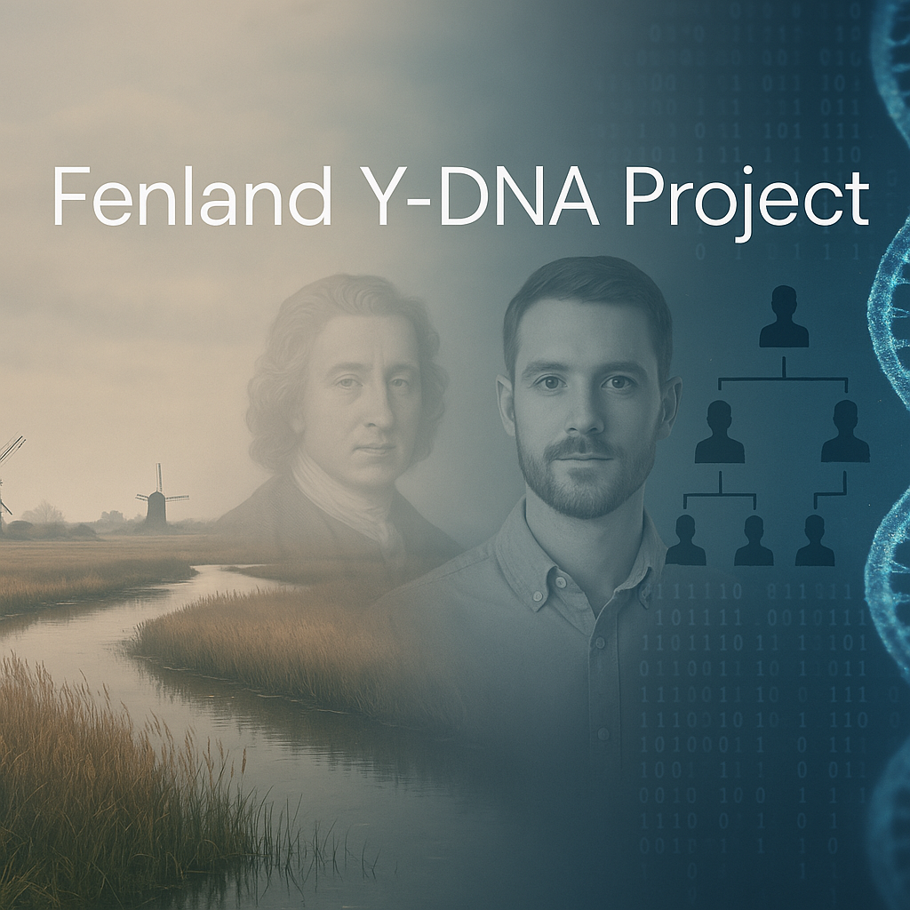

## Fenland Y-DNA Project

{ width="300" align="center" }

This project seeks to drive the uptake of Y-DNA testing amongst the current male population of the English Fens.
Ideally all should have paternal-line ancestors that can be found in the 19th century census records, bearing the same or similar surname.

