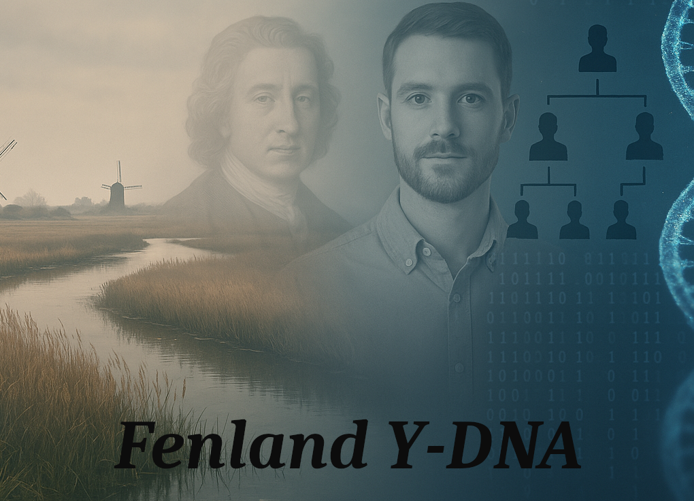

# Fenland Y-DNA Campaign

{ width="600" align="center" }

## Campaign Aims

This promotional campaign aims to drive the uptake of genealogical Y-DNA testing amongst the current male population of the [English Fenlands](https://en.wikipedia.org/wiki/The_Fens). It will do so through publicity with the various family and local history groups - and other channels - with an additional hope of being able to sponsor selected testees. The aim is to direct potential candidates to the appropriate project administrators (Surname and/or Geographical) where funds may be available.

This campaign is not in-itself a FTDNA Y-DNA project - it will utilise existing projects and the expertise of current project administrators.

The campaign seeks to launch in late 2025 but this depends on the publication schedules and opportunities for announcements. It is likely to run for at least 6-12 months.

### Project Activities

 * Identify the relevant FTDNA projects that have interests in the area
 * Contact with the relevant local history / family history groups for advice / target family names.
 * Arrange talks and/or articles with the above - who is local or can travel there and can speak about Y-DNA ?

## Suitable Testing Candidates

You need to be:

 * A biological male (i.e. have a Y-chromosome) 
 * Bear a patrilineal surname, i.e. the same surname as your father, his father etc.
 * You should have paternal line ancestry from the English Fenlands, which appears on any 19th century census or earlier records from the region.
 * If you or any of your direct paternal line are known or suspected to be adopted this needs to be declared.
 * Funding, where available, may require additional criteria according to the relevant project administrator.
 * Ultimately the project administrators will determine the suitabilty of the candidate for their project.

## What do I do next ?

 * If you have tested with Ancestry or 23andMe - you should [transfer your results over to FTDNA](https://help.familytreedna.com/hc/en-us/articles/4402392808463-Transferring-Your-Autosomal-DNA-From-Another-Company). Then join the relevant surname project. Please note that this option might not be viable for results from 2026 or later.
 * If you have not previously tested, you should check to see if there is a relevant surname project first because their admin might be able to sponsor you.
 * If there is no relevant surname project - you should order a Y-32 test from FTDNA.

 
 * Join the Rare surnames project if your surname is rare otherwise join the East Anglia DNA project.
 * Once your FTDNA account is established you can join multiple projects.

## Relevant Y-DNA Surname Projects

| Project Name |  Surname(s) | URL | Sponsorship Available ? |
| ------------ |  -----------| --- | ---------------------   |
| Bourne / Burn / Bourn  | Bourne | [https://www.familytreedna.com/groups/bourne/about](https://www.familytreedna.com/groups/bourne/about) |  | |
| Cox          |  Cox        | [https://www.familytreedna.com/groups/cox-dna-study/about/](https://www.familytreedna.com/groups/cox-dna-study/about/)    |   Check with admins       |
| Fenn / Fann  | Fenn / Fann | [https://www.familytreedna.com/groups/the-fann-and-fenn-dna-group-study/about](https://www.familytreedna.com/groups/the-fann-and-fenn-dna-group-study/about) | |
| Fleet        | Fleet | [https://www.familytreedna.com/groups/fleet/about](https://www.familytreedna.com/groups/fleet/about) | | |
| Girdlestone |  Girdlestone | [https://www.familytreedna.com/groups/girdlestone-surname/about](https://www.familytreedna.com/groups/girdlestone-surname/about) |   | | 
| Holmes      |  Holmes | [https://www.familytreedna.com/groups/holmes/about/background](https://www.familytreedna.com/groups/holmes/about/background) |  ||
| Hooper      |  Hooper | [https://www.familytreedna.com/groups/hooper/about](https://www.familytreedna.com/groups/hooper/about) | ||
| Langton / Lenton  |  Lenton     | [https://www.familytreedna.com/groups/langton/about](https://www.familytreedna.com/groups/langton/abou) | |
| P-L-N        |  Pealing, Pelling, Peling etc. | [https://www.familytreedna.com/groups/pelan/about](https://www.familytreedna.com/groups/pelan/about)    |  Yes |    
| Rare Surnames  |  Rare surnames UK & Ireland  | [https://www.familytreedna.com/groups/rare-family-names-uk-ireland/about](https://www.familytreedna.com/groups/rare-family-names-uk-ireland/about)   | Check with admins| 
| Sykes / Sike | Sykes / Sike | [https://www.familytreedna.com/groups/sikes-sykes-dna-project/about/](https://www.familytreedna.com/groups/sikes-sykes-dna-project/about/) | |
| Toynbee      |  Toynbee, Taughenbaugh | [https://www.familytreedna.com/groups/toynbee/about/background](https://www.familytreedna.com/groups/toynbee/about/background) | |
| Fentress     |  Ventress   | [https://www.familytreedna.com/groups/fentress/about](https://www.familytreedna.com/groups/fentress/about) |  |

There is a generic East Anglia DNA project (for Y-DNA and mtDNA) - [https://www.familytreedna.com/groups/east-anglia/about/background](https://www.familytreedna.com/groups/east-anglia/about/background).

## Names that have been Suggested

* Hannent

## Local Family History Societies

* Fenland FHS - [http://www.fenlandfhs.org.uk/](http://www.fenlandfhs.org.uk/)
* Cambridgeshire and Huntingdonshire FHS - https://www.chfhs.org.uk/
* Lincolnshire FHS - https://www.lincolnshirefhs.org.uk/
* Norfolk FHS - https://www.norfolkfhs.org.uk/
* Suffolk FHS - https://www.suffolkfhs.co.uk/
