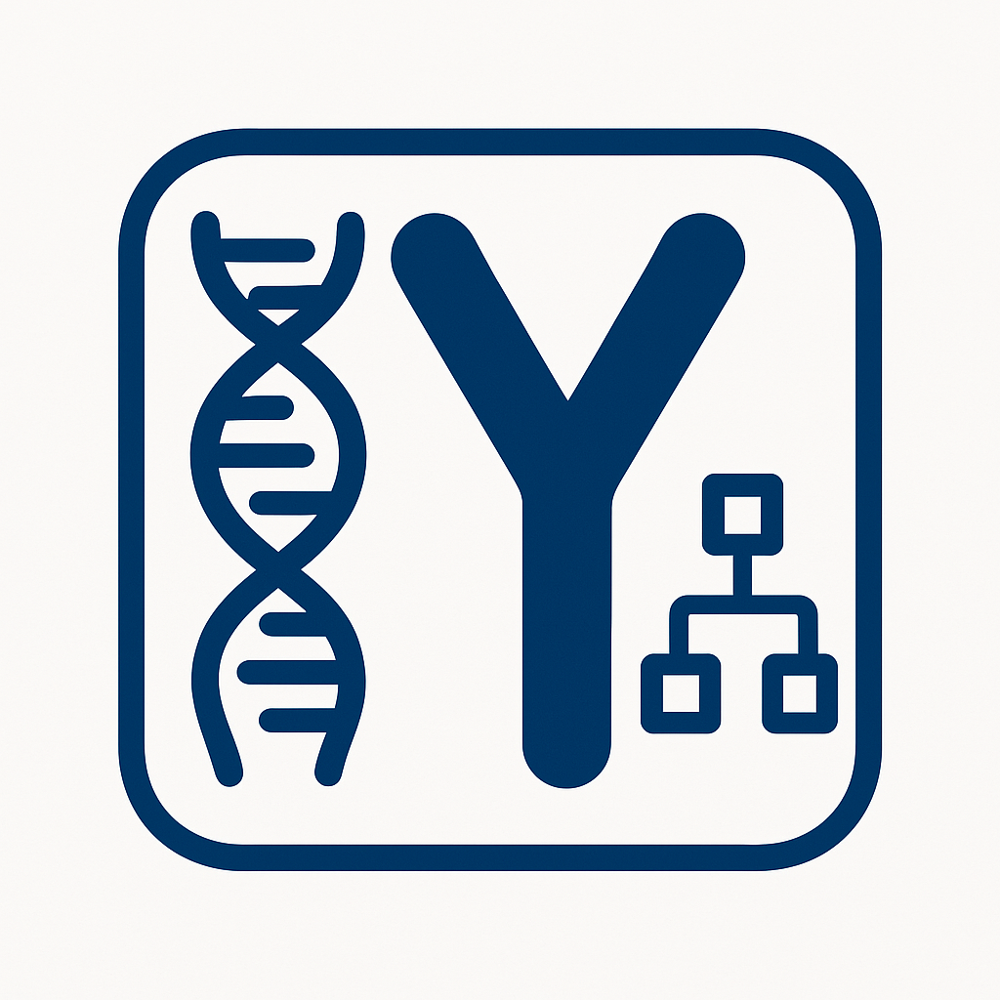

{ width="100" align="left" }

# Y-DNA for Genetic Genealogy

Y-DNA testing is a powerful tool for genealogists and surname researchers, offering a unique window into paternal lineage. As the Y chromosome is passed virtually unchanged from father to son, it can be used to trace direct male ancestry over many generations. This makes it especially valuable for exploring surname origins (if patrilineal), identifying common ancestors, and confirming or disproving suspected family connections. For those with brick walls in their paternal line, Y-DNA testing can provide new leads and connect individuals with distant cousins who share a common paternal ancestor.
One of the most compelling uses of Y-DNA testing is in surname studies. Since surnames often follow the paternal line in many cultures, Y-DNA results can help determine whether individuals with the same surname are genetically related - i.e. if they share a common paternal-line ancestor. This can be extremely useful in cases where historical records are scarce or incomplete. By joining surname projects and comparing results with others, testers can contribute to a broader understanding of surname evolution and migration patterns.

## Overlooked

Y-DNA testing tends to be less frequently done than standard autosomal testing (as provided by, for example, Ancestry, MyHeritage, 23andMe, FTDNA 'Family Finder'). This is partly because it tends to get less attention, only biological men can do it and because only one testing company provides comprehensive Y-DNA testing, namely FTDNA, with the essential database for matching results. While one company may sound like a restiction, this does mean that there is a single Y-DNA database with consistent testing and reporting standards.

Y-DNA can 'reach back' further in time than traditional autosomal testing because there is no genetic mixing of Y-DNA at every generation. It does however only follow the paternal line - an outer edge of your family tree.
 
## Who should test ?

Ideally everyone with a Y-chromosome who can afford it ! In practice this isn't necessary and there are certain biological men that could be regarded as a priority:

 * Those from extended families where no one has been Y-DNA tested.
 * Those who don't have any other close male-line relatives (up to 4th/5th cousin) - i.e. those that consider themselves the last in 'their line', without biological sons.
 * Those with patrilineal surnames that are rare or that are otherwise unusual or atypical to the relevant region.
 * Those with surnames that are often confused with other similar surnames.
 * Those that are interested in their deep ancestry.

If you are female you might try to persuade a male family member to get tested. This will only provide insight along the purely paternal line but it is generally
unambiguous at sufficient resolution.

## Projects - Surname and/or Geographic

You should try to find a surname project that relates to your paternal line. These may focus on surnames or geographical areas. Some projects have funds that might be able to subsidise or entirely pay for the testing of suitable candidates.

Note that if you are aware of or suspect an adoption or surname-change along your paternal line, you should be open about this as it will otherwise mislead the contextual analysis of your Y-DNA data.

## What test to go for ?

If you are a member of a project, the administrators of that project are normally best placed to advise you, although advice may also be sought from various Y-DNA dedicated online fora or Facebook groups. 

The default option is normally to go for the Y-37 test and then assess the situation after you have obtained your results. If money is no object then just go for the 'Big Y' test aka Y-700, but this is likely to be
a waste of money if a close paternal-line male has already tested to this level. Your results would not be significantly different and nothing will be learned.

### Transfer of Existing Autosomal Data

If you have already tested with Ancestry, 23and Me or MyHeritage, you can import your results into FTDNA and for a small charge they will make a call on your Y-haplogroup. This can be very useful for a Y-DNA project manager as a starting point as it can indicate if further Y-DNA testing will be fruitful. If you do need to be tested, you will need to be issued with a test kit from FTDNA and your most recent haplogroup(s) can then be estimated or precisely determined by FTDNA's native Y-DNA tests.

* See [FTDNA - Autosomal DNA Data Transfers](https://help.familytreedna.com/hc/en-us/articles/4415446123663-Autosomal-DNA-Transfers)

## Cautions

There are important cautions to consider. Unexpected results, such as non-paternity events (where the presumed father, grandfather etc. is discovered not to be the biological father, grandfather etc.), can arise and this could be traumatic to the tester or his extended family members. Privacy is another concern; while Y-DNA projects do not typically reveal the names of the testees - just the surname & earliest known paternal ancestor - if you have a rare name it may be possible to work out who you are. That said Y-DNA information is relatively benign and non-medical in nature but it is theoretically possible your Y-DNA results could correlate with some Y-chromosome disease that could be found in the future. As this would also correlate with your surname, the publishing of Y-DNA information does not substantively add to the risk.  Ultimately many people are happy to share their Y-DNA results pseudonymously in return for the knowledge it brings.

Overall, Y-DNA testing can be a rewarding and enlightening experience for those interested in deepening their understanding of paternal heritage. When approached with realistic expectations and an awareness of potential surprises, it can significantly enhance genealogical research.

## Disclaimer


